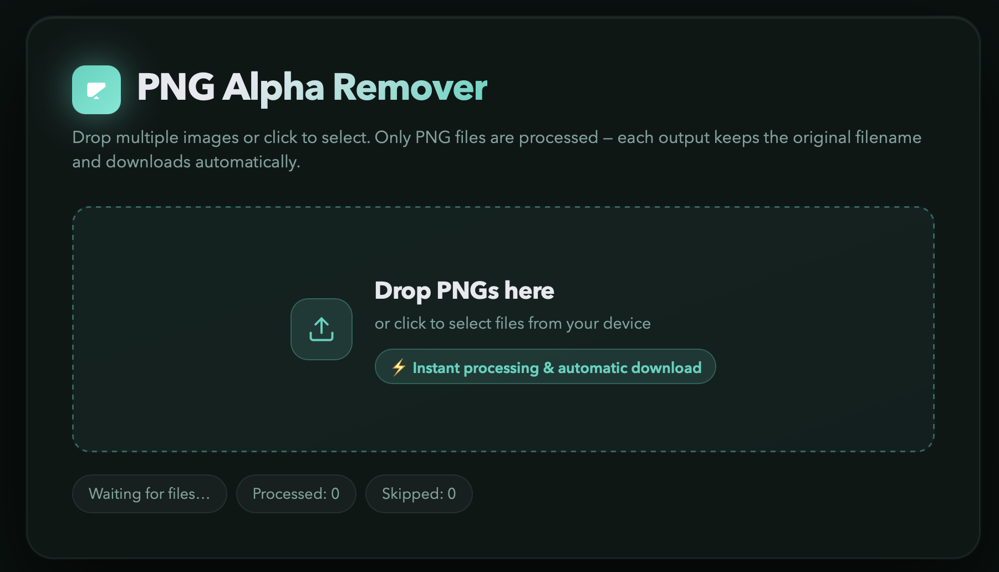

# PNG Alpha Remover

PNG Alpha Remover is a lightweight frontend tool that processes PNG files locally in the browser.
This repository provides a drag-and-drop interface, removes the alpha channel from each PNG file, and automatically downloads the processed results.

[Use PNG Alpha Remover](https://rawcdn.githack.com/xremix/PNG-Alpha-Remover/faf44276c36b2e887296cd3513ad2a83c94539bd/png-alpha-remover.html)

## What This Repository Does

- Provides a modern drag-and-drop upload area
- Accepts multiple files at once
- Validates type and extension (PNG files only)
- Converts transparent pixels to fully opaque pixels on a white background
- Downloads each processed file with its original filename
- Shows live status for processed, skipped, and failed files

## Common Use Cases

- Flatten PNG exports from Figma or similar design tools when you need a solid white background instead of transparency
- Prepare screenshots or marketing assets for App Store, marketplace, or submission workflows that do not handle transparent PNGs well
- Reduce file complexity when transparency is no longer needed and a plain non-transparent PNG is sufficient
- Avoid unexpected dark or checkerboard backgrounds in CMS previews, upload tools, or internal asset systems
- Standardize image handoff for clients, content teams, and marketplaces that expect flat image assets
- Clean up logos, mockups, UI screenshots, and product images before documentation or publishing

## Why Someone Would Need This

Many design and export workflows produce PNG files with an alpha channel by default, even when the final asset should appear on a white background everywhere.
That becomes a problem when a platform, preview component, storefront, or upload form assumes a non-transparent image.

This tool solves that by converting each PNG locally in the browser, which is useful when:

- transparency causes rendering issues in app listing screenshots
- a PNG should look identical across light and dark interfaces
- a content pipeline does not preserve alpha correctly
- you want a quick browser-based fix without opening Photoshop or another editor

## How It Works Technically

- `png-alpha-remover.html` contains the app structure
- `styles.css` contains all styling
- `main.js` processes files in the browser via Canvas:
  - The image is loaded
  - Pixel data is read
  - RGB channels are blended over white based on alpha values
  - Alpha is forced to `255`
  - The result is exported as PNG and downloaded

## Why It Runs Locally

All processing runs client-side in the browser. No files are uploaded to a server, which keeps the workflow fast and privacy-friendly.

## Usage

1. Open `png-alpha-remover.html` in your browser.
2. Drag PNG files into the drop area or click to select files.
3. Downloads start automatically after processing.
